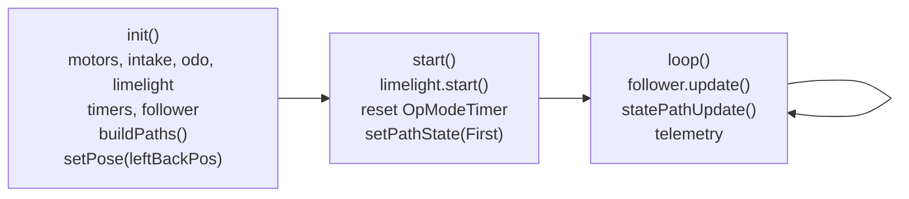
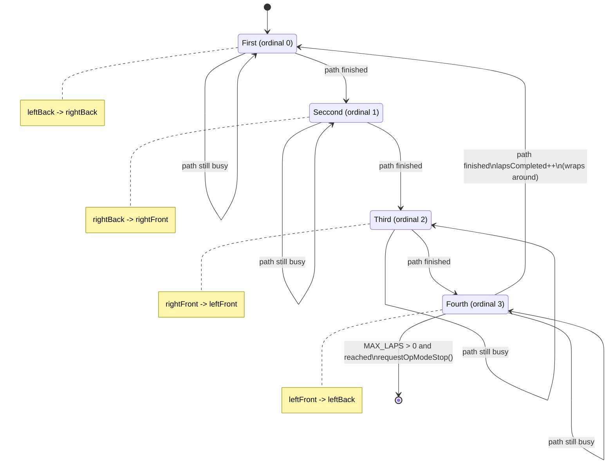

# Challenge_6 — Four-Leg Looping Path Runner

`Challenge_6.java` is an `@Autonomous` OpMode (`"8lb Fish Challenge 6"`) that drives a closed
four-leg route over and over. It extends the **iterative `OpMode`** (`init()` / `start()` /
`loop()`), and all motion is delegated to a Pedro Pathing `Follower` — the OpMode itself never
sets a motor power.

The structure is a small finite-state machine: one `PathState` per leg, each leg is one
`PathChain`, and `loop()` advances to the next state when the follower reports the current path
is done. After the last leg it wraps back to the first, so the route repeats until the
autonomous period ends.

---

## Is the robot running in a square?

**Intent: yes. As currently written: no — it doesn't move at all.**

The route is *shaped* like a square. The four corner poses are named for the corners of one
(`leftBackPos` → `rightBackPos` → `rightFrontPos` → `leftFrontPos` → back to `leftBackPos`), and
`buildPaths()` wires them into a closed loop of four straight `BezierLine` legs. That is a square
traversal.

But all four corners are the same point:

```java
private final Pose leftBackPos   = new Pose(0, 0, Math.toRadians(0));
private final Pose rightBackPos  = new Pose(0, 0, Math.toRadians(0));
private final Pose rightFrontPos = new Pose(0, 0, Math.toRadians(0));
private final Pose leftFrontPos  = new Pose(0, 0, Math.toRadians(0));
```

Every leg is therefore a **zero-length path from (0,0) to (0,0)**. The state machine will run
correctly — it starts each path, sees `!follower.isBusy()`, and advances — but the robot sits
still and spins through all four states in roughly 0.4 s per "lap" (each leg is held for at least
`MIN_PATH_SECONDS = 0.1`). Telemetry will show `Laps Completed` climbing quickly with the robot
parked on the spot.

**To make it actually drive a square,** give the four poses real corner coordinates. For a 24-inch
square starting at the origin, in Pedro's convention (X forward, Y left, heading CCW):

| Pose | Suggested value | Leg it starts | Motion |
|------|-----------------|---------------|--------|
| `leftBackPos` | `new Pose(0, 0, Math.toRadians(0))` | `first` | strafe right |
| `rightBackPos` | `new Pose(0, -24, Math.toRadians(0))` | `seccond` | drive forward |
| `rightFrontPos` | `new Pose(24, -24, Math.toRadians(0))` | `third` | strafe left |
| `leftFrontPos` | `new Pose(24, 0, Math.toRadians(0))` | `fourth` | drive backward |

Two things follow from keeping every heading at `0`:

- The heading interpolation on each leg is `0° → 0°`, so the robot **never rotates**. It translates
  around the square facing one direction the whole time — a mecanum crab-walk square, not a
  drive-and-turn square. That is a legitimate square path; just be aware it is the one you get.
- If you want the robot to turn each corner instead, set each pose's heading to the direction of
  travel for the leg that *leaves* it (e.g. `0°`, `90°`, `180°`, `270°`), and the existing
  `setLinearHeadingInterpolation(...)` calls will rotate it through each corner.

Whether the shape is a true square (equal sides, right angles) is entirely up to those four
numbers — nothing in the code enforces it.

---

## Hardware & key fields

| Field | `hardwareMap` name | Type | Purpose |
|-------|--------------------|------|---------|
| `frontRight` / `frontLeft` / `backRight` / `backLeft` | `"rightFront"` / `"leftFront"` / `"rightBack"` / `"leftBack"` | `DcMotor` | Looked up and direction-set, but **never commanded** — see rough edges |
| `intake` | `"intake"` | `DcMotorEx` | Looked up, currently unused |
| `odo` | `"odo"` | `GoBildaPinpointDriver` | Read directly in `loop()`; also the follower's localizer |
| `limelight3A` | `"limelight"` | `Limelight3A` | Pipeline `9` (color tracking); results shown in telemetry only |
| `follower` | — | Pedro `Follower` | Built by `Constants.createFollower(hardwareMap)`; owns the drivetrain |
| `pathTimer` | — | `com.pedropathing.util.Timer` | Time since entering the current state |
| `OpModeTimer` | — | `com.pedropathing.util.Timer` | Time since `start()` |

### Constants

- `MAX_LAPS = 0` — `0` (or less) means loop forever. Set it to a positive number and the OpMode
  calls `requestOpModeStop()` after that many complete laps.
- `MIN_PATH_SECONDS = 0.1` — a state must be active this long before `!follower.isBusy()` is
  believed. Without it, the tick right after `followPath(...)` can still read "not busy" and the
  machine would skip the entire route in one loop iteration.

---

## Lifecycle



`init()` builds the paths *after* creating the follower (`buildPaths()` needs
`follower.pathBuilder()`), then seeds the follower's pose to the first corner so its idea of
"where I am" matches the start of leg one.

`start()` re-enters `First` via `setPathState(...)` rather than just assigning the field — that
resets `pathTimer` and clears `pathStarted`, which is what arms the first path to be handed to
the follower on the first `loop()` tick.

---

## State machine



### How one tick works

`statePathUpdate()` is called once per `loop()` and does exactly one of three things:

1. **No path for the state** → telemetry warning, return. (Only reachable if a `PathState`
   constant is added without a matching `case` in `pathFor`.)
2. **Path not started yet** (`!pathStarted`) → `follower.followPath(path, true)`, set
   `pathStarted = true`, return. This guard is the important one: without it the OpMode would
   re-issue the same path every tick and the follower would restart it forever.
3. **Path started and finished** (`currentPathFinished()`) → compute `nextState(...)`, bump the
   lap counter if it wrapped, stop if `MAX_LAPS` is reached, otherwise `setPathState(next)`.

### Ordering and wrap-around

The enum's **declaration order is the run order** — `First` = 0 through `Fourth` = 3 — and the
advance is pure arithmetic on `ordinal()`:

```java
public PathState nextState(PathState state){
    PathState[] order = PathState.values();
    return order[(state.ordinal() + 1) % order.length];
}
```

`values()` returns constants in declaration order, so `% order.length` is what turns the list into
a ring: `Fourth` (3 + 1 = 4, mod 4 = 0) lands back on `First`. `wrappedAround(next)` just checks
`ordinal() == 0` to detect that a lap boundary was crossed.

To add a leg, insert a constant at the position it should run, add a `PathChain` field, build it
in `buildPaths()`, and add one `case` to `pathFor()`. Nothing renumbers.

---

## Method reference

| Method | Role |
|--------|------|
| `buildPaths()` | Builds the four `BezierLine` legs into a closed loop, each with linear heading interpolation between its endpoints. Must run after the follower exists. |
| `pathFor(state)` | Maps a `PathState` to its `PathChain`. Returns `null` for an unmapped state. |
| `nextState(state)` | The next state in declaration order, wrapping last → first. |
| `wrappedAround(state)` | `true` when the given state is ordinal 0, i.e. a new lap just began. |
| `setPathState(newState)` | Enters a state: stores it, clears `pathStarted`, resets `pathTimer`. Always use this instead of assigning `pathState` directly. |
| `currentPathFinished()` | `pathStarted && pathTimer > MIN_PATH_SECONDS && !follower.isBusy()`. |
| `statePathUpdate()` | One tick of the machine (start path, or advance). |

---

## Telemetry

`loop()` reports the current state with its step number (`"Seccond (step 2 of 4)"`), the next
state, `Laps Completed`, `Follower Busy`, the follower's `x` / `y` / `heading`, and both timers.
Limelight `tx` / `ty` / `ta` are added when a valid result is available.

`Follower Busy` is the field to watch when debugging advancement: if it never goes false the
machine is stuck on a leg; if it is false immediately every time, the paths are zero-length (the
current state of the file).

---

## Things to watch / known rough edges

- **The corner poses are all `(0, 0, 0)`.** Nothing moves until they are filled in. See the square
  section above.
- **The four `DcMotor` handles are dead weight.** `frontRight`, `frontLeft`, `backRight` and
  `backLeft` are fetched and two of them get `setDirection(REVERSE)`, but nothing ever sets a
  power on them — the `Follower` owns the drivetrain through its own handles from
  `Constants.driveConstants`. The manual `setDirection` calls happen *before*
  `Constants.createFollower(...)` in `init()`, so the follower's own directions
  (`leftFront` FORWARD, `leftBack`/`rightFront`/`rightBack` REVERSE) overwrite them and the robot
  drives correctly. **If those lines are ever reordered so `createFollower` runs first, the manual
  reversals win and the drivetrain will misbehave.** Safest fix is to delete the unused motor
  lookups and direction calls entirely.
- **`odo` is updated twice per loop.** `Constants.localizerConstants` points the follower's
  Pinpoint localizer at the same `"odo"` device, and `follower.update()` already reads it;
  `loop()` then calls `odo.update()` again. That is redundant I2C traffic on the critical path and
  will slow the loop. The `Pose2D pos` it produces is never used — reading pose from
  `follower.getPose()` (as the telemetry already does) is enough.
- **`intake` is looked up but never used**, so the OpMode will still fail at init if the
  `"intake"` port is missing from the robot configuration.
- **The limelight is started and polled but drives no decisions.** Its results only reach
  telemetry; the pipeline switch to `9` happens in `init()`.
- **`MAX_LAPS = 0` means this never stops on its own** — it runs the loop until the autonomous
  period ends or the OpMode is stopped.
- **Spelling:** the enum constant is `Seccond` (two c's). It is consistent throughout the file, so
  it works; just match it when adding `case` labels.